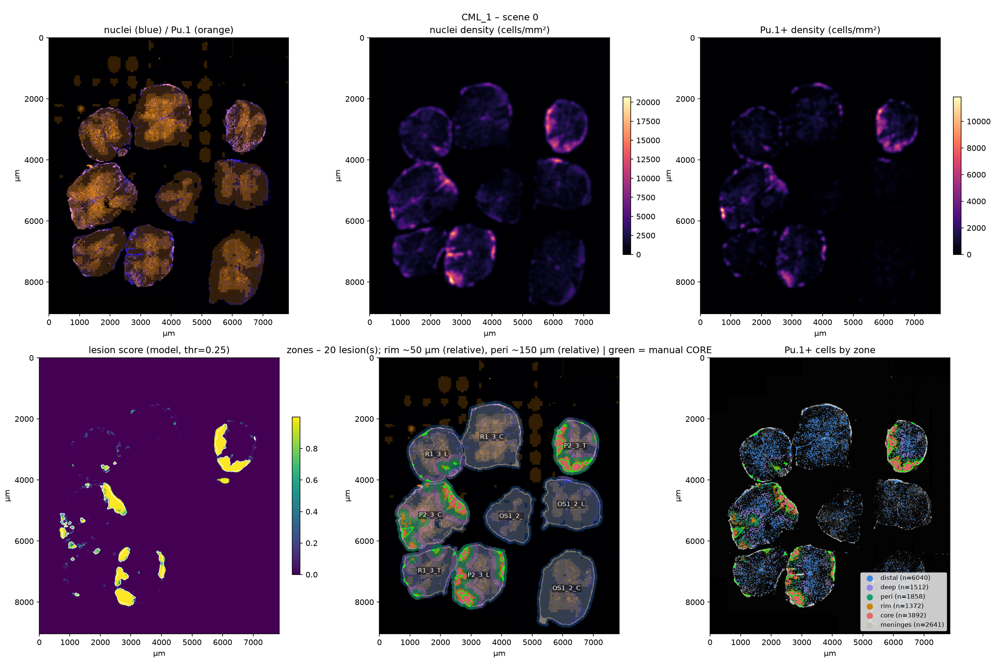
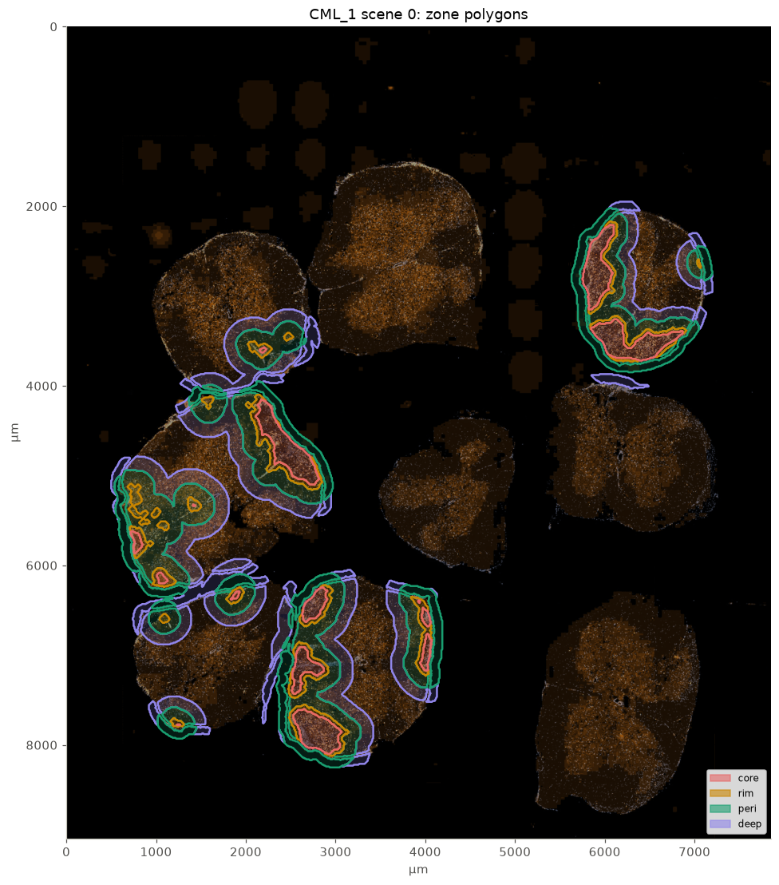
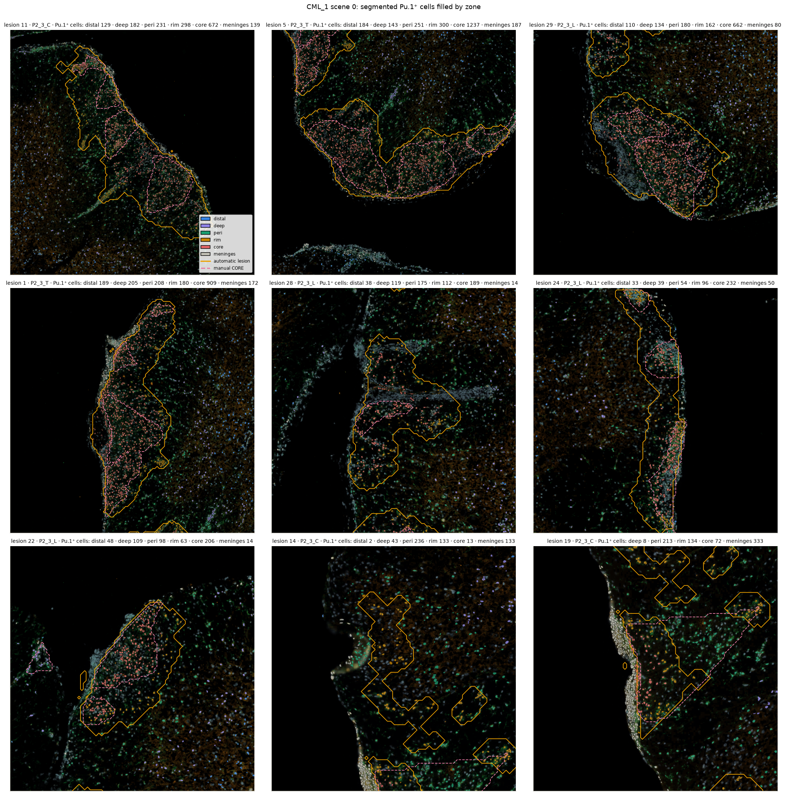
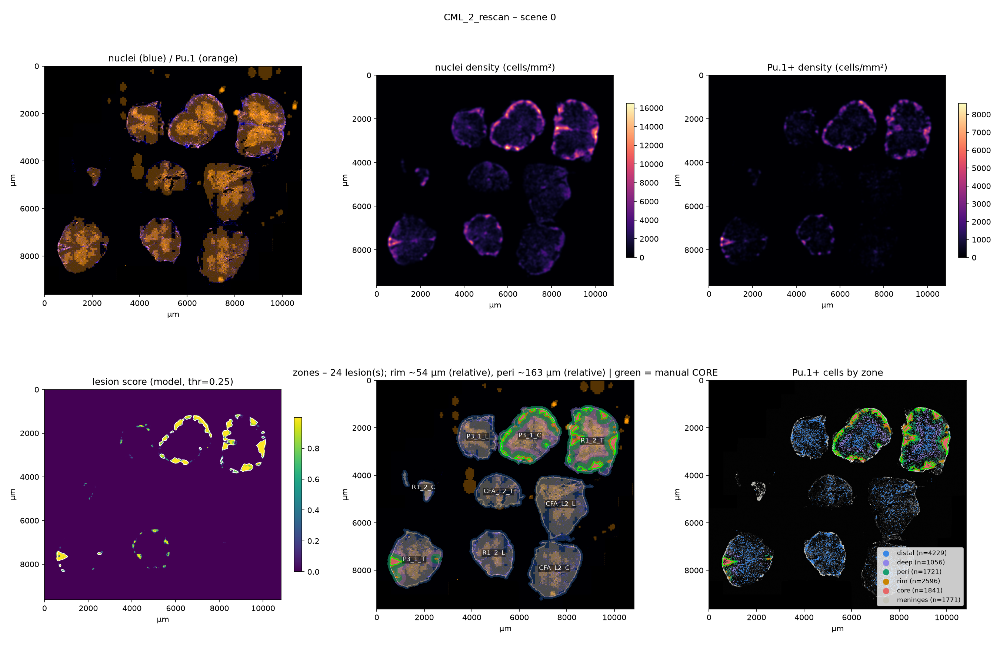
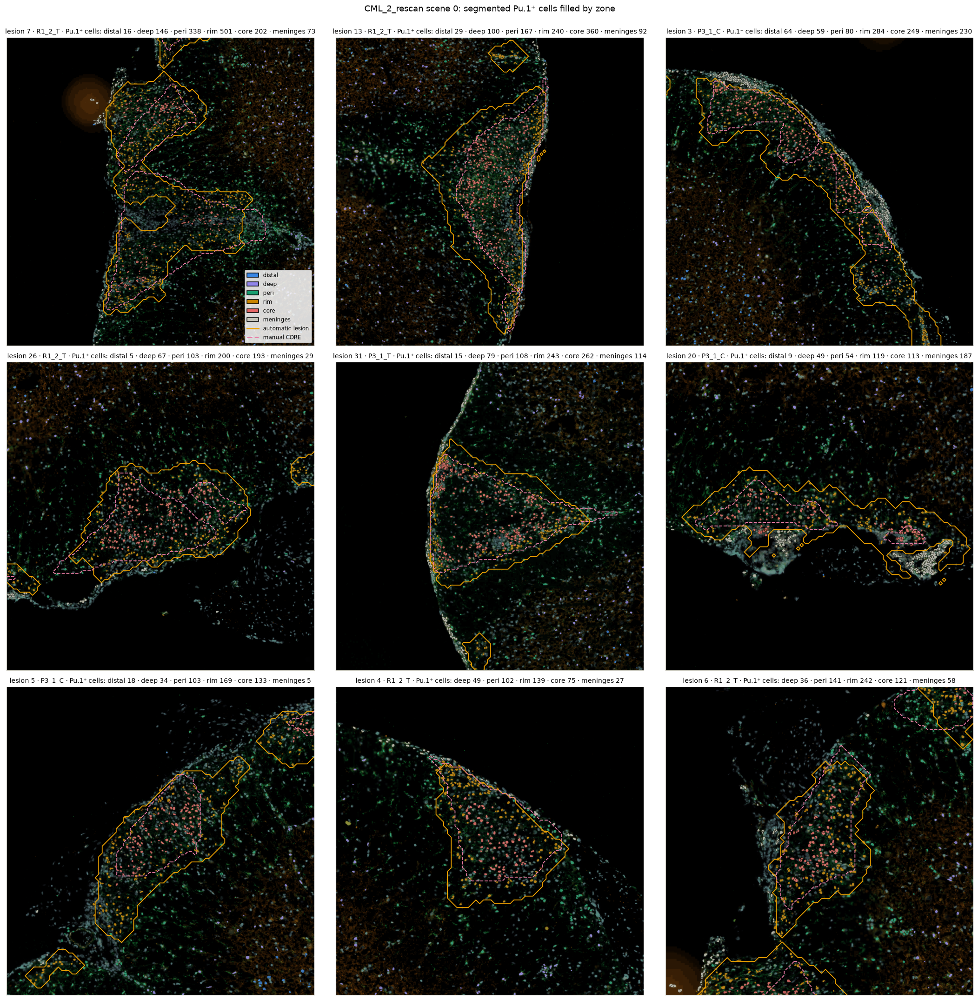
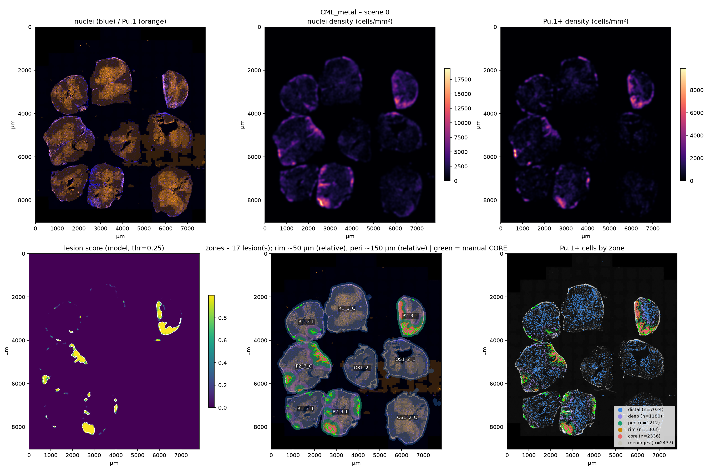
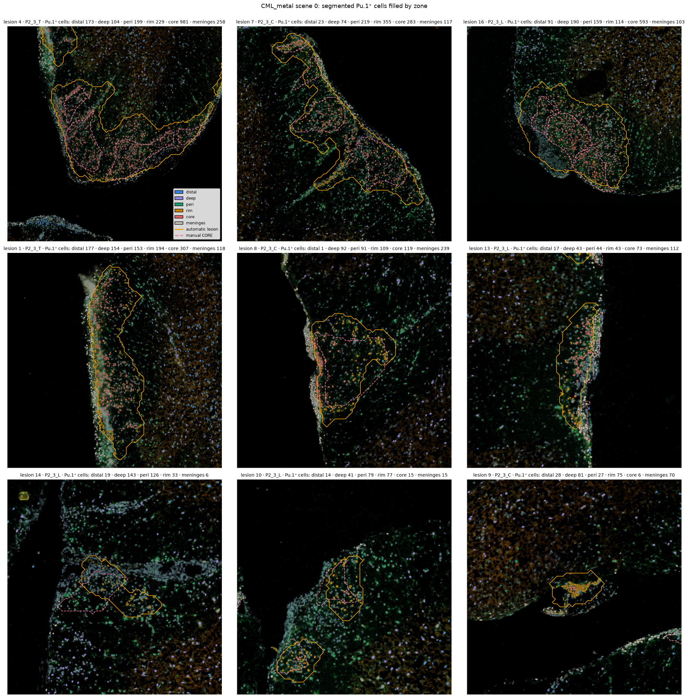
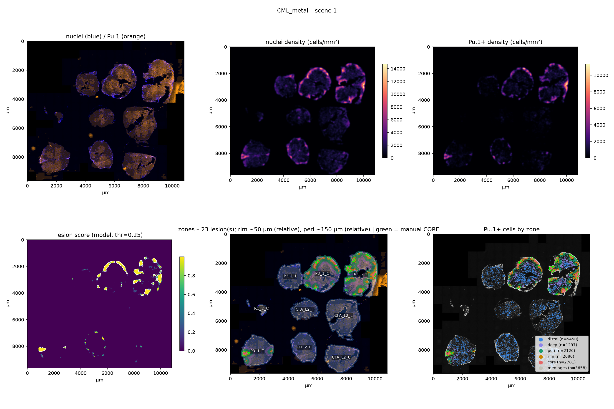
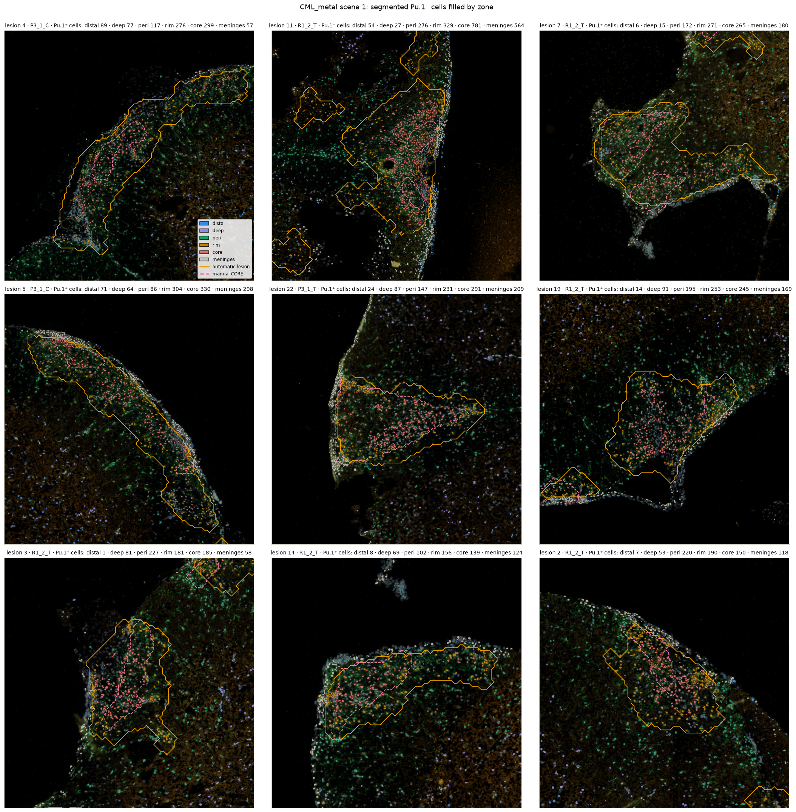

# lesionSegmenter – report (2026-10-05)

Automatic outlining of EAE lesions from Cellpose segmentation masks and the collaborator's Pu.1 calls,
zoning into core / rim / peri-lesion, and selection of Pu.1⁺ cells per capture site for Deep Visual
Proteomics (laser microdissection + mass spectrometry). This report is generated from the run outputs;
the notebooks in `notebooks/` hold the image evidence behind every number.

**Decisions taken in this run** (all configurable in `configs/eae_dvp_sdata.yaml`):

- Input: SpatialData export `cellpose_output.zip` (4 scenes, 218,746 cells, label = cell_id; Pu.1 positivity from `Pu1_class`).
- Lesion score: **model** – a gradient-boosting model trained on the collaborator's manual CORE polygons, one leave-one-scene-out model per scene (each scene scored by a model that never saw its own annotations). Threshold {'type': 'absolute', 'value': 0.25, 'seed': 0.5}.
- Sections (animal + spinal level) from the curated `Sample_category` polygons; **only sections with manually annotated cores carry lesions** (`sections.focus: manual`); all other sections are lesion-free controls.
- Distances relative to section size: zone widths are fractions of each section's equivalent radius (rim 0.05, peri 0.15 → median 50 / 150 µm); rings for wells at 0–10 %, 10–20 %, 20–40 % of the radius; every cell carries `rel_pos` (0 = section centre / canal, 1 = pia).
- Manual annotations are used **only** for model training and validation, never to draw lesions directly.

## Headline numbers per scene

| scene | cells | Pu.1+ | Pu.1+ frac | lesions | lesion sections | sections | auto lesion mm² | manual core mm² | manual cores | cores ≥50% covered | manual area covered | wells |
|---|---|---|---|---|---|---|---|---|---|---|---|---|
| CML_1 scene 0 | 57044 | 17315 | 0.30 | 22 | 5 | 9 | 1.61 | 0.69 | 34 | 0.71 | 0.86 | 41 |
| CML_2_rescan scene 0 | 60095 | 13214 | 0.22 | 36 | 3 | 9 | 1.54 | 0.97 | 25 | 0.84 | 0.83 | 31 |
| CML_metal scene 0 | 50627 | 15502 | 0.31 | 17 | 5 | 9 | 1.10 | 0.44 | 33 | 0.48 | 0.82 | 39 |
| CML_metal scene 1 | 50980 | 17992 | 0.35 | 35 | 3 | 9 | 1.50 | 0.36 | 20 | 0.90 | 0.89 | 30 |

## Pu.1⁺ cells from the segmentation mask (no zoning)

| sample | scene | n_cells | n_pu1_pos | frac_pu1 |
|---|---|---|---|---|
| CML_1 | 0 | 57044 | 17315 | 0.304 |
| CML_2_rescan | 0 | 60095 | 13214 | 0.220 |
| CML_metal | 0 | 50627 | 15502 | 0.306 |
| CML_metal | 1 | 50980 | 17992 | 0.353 |
| ALL |  | 218746 | 64023 | 0.293 |

Per animal and spinal level (T = thoracic, C = cervical, L = lumbar; CFA = adjuvant-only control, OS = other control):

| animal | level | n_sections | n_cells | n_pu1_pos | area_pu1_um2 | frac_pu1 |
|---|---|---|---|---|---|---|
| CFA_L2 | C | 2 | 9162 | 1371 | 47707.861 | 0.150 |
| CFA_L2 | L | 2 | 9666 | 1263 | 43992.076 | 0.131 |
| CFA_L2 | T | 2 | 4515 | 416 | 13395.239 | 0.092 |
| OS1_2 | nan | 2 | 4909 | 599 | 19511.309 | 0.122 |
| OS1_2 | C | 2 | 8985 | 1350 | 42001.227 | 0.150 |
| OS1_2 | L | 2 | 7936 | 1219 | 40833.584 | 0.154 |
| P2_3 | C | 2 | 19080 | 7283 | 209074.707 | 0.382 |
| P2_3 | L | 2 | 19852 | 5916 | 181521.901 | 0.298 |
| P2_3 | T | 2 | 14460 | 6711 | 180567.748 | 0.464 |
| P3_1 | C | 2 | 22174 | 7512 | 233282.693 | 0.339 |
| P3_1 | L | 2 | 8492 | 1621 | 48555.058 | 0.191 |
| P3_1 | T | 2 | 13079 | 3539 | 108026.755 | 0.271 |
| R1_2 | C | 2 | 1164 | 138 | 4313.875 | 0.119 |
| R1_2 | L | 2 | 11153 | 2724 | 78874.992 | 0.244 |
| R1_2 | T | 2 | 29187 | 12257 | 385044.701 | 0.420 |
| R1_3 | C | 2 | 11433 | 4003 | 108008.682 | 0.350 |
| R1_3 | L | 2 | 10253 | 3329 | 90617.267 | 0.325 |
| R1_3 | T | 2 | 8478 | 2042 | 56664.619 | 0.241 |
| unassigned | nan | 4 | 4768 | 730 | 21026.983 | 0.153 |

## Sections

| scene | section_name | is_lesion_section | has_manual_core | area_mm2 | n_cells | n_pu1_pos | frac_pu1_pos | n_lesions | lesion_area_mm2 | lesion_frac_of_section | lesion_area_frac_unrestricted |
|---|---|---|---|---|---|---|---|---|---|---|---|
| CML_1 scene 0 | P2_3_T | True | True | 1.859 | 8217 | 3740 | 0.455 | 3 | 0.504 | 0.271 | 0.326 |
| CML_1 scene 0 | R1_3_C | False | False | 3.366 | 5995 | 2055 | 0.343 | 0 | 0.000 | 0.000 | 0.002 |
| CML_1 scene 0 | R1_3_L | True | True | 2.452 | 5481 | 1703 | 0.311 | 2 | 0.032 | 0.013 | 0.013 |
| CML_1 scene 0 | OS1_2_L | False | False | 2.508 | 4403 | 491 | 0.112 | 0 | 0.000 | 0.000 | 0.021 |
| CML_1 scene 0 | OS1_2_ | False | False | 1.895 | 2606 | 263 | 0.101 | 0 | 0.000 | 0.000 | 0.000 |
| CML_1 scene 0 | P2_3_C | True | True | 3.542 | 9974 | 4245 | 0.426 | 8 | 0.486 | 0.137 | 0.161 |
| CML_1 scene 0 | OS1_2_C | False | False | 3.474 | 4634 | 487 | 0.105 | 0 | 0.000 | 0.000 | 0.000 |
| CML_1 scene 0 | P2_3_L | True | True | 2.722 | 10451 | 3111 | 0.298 | 4 | 0.556 | 0.204 | 0.241 |
| CML_1 scene 0 | R1_3_T | True | True | 2.171 | 4403 | 1057 | 0.240 | 3 | 0.037 | 0.017 | 0.019 |
| CML_2_rescan scene 0 | R1_2_T | True | True | 4.785 | 15395 | 4710 | 0.306 | 12 | 0.820 | 0.171 | 0.188 |
| CML_2_rescan scene 0 | P3_1_C | True | True | 4.033 | 12236 | 3392 | 0.277 | 8 | 0.560 | 0.139 | 0.155 |
| CML_2_rescan scene 0 | P3_1_L | False | False | 2.242 | 4677 | 923 | 0.197 | 0 | 0.000 | 0.000 | 0.023 |
| CML_2_rescan scene 0 | CFA_L2_L | False | False | 4.135 | 4963 | 441 | 0.089 | 0 | 0.000 | 0.000 | 0.000 |
| CML_2_rescan scene 0 | CFA_L2_T | False | False | 1.975 | 2547 | 210 | 0.082 | 0 | 0.000 | 0.000 | 0.000 |
| CML_2_rescan scene 0 | R1_2_C | False | False | 0.344 | 822 | 120 | 0.146 | 0 | 0.000 | 0.000 | 0.000 |
| CML_2_rescan scene 0 | CFA_L2_C | False | False | 3.719 | 5267 | 459 | 0.087 | 0 | 0.000 | 0.000 | 0.000 |
| CML_2_rescan scene 0 | R1_2_L | False | False | 2.488 | 5777 | 1186 | 0.205 | 0 | 0.000 | 0.000 | 0.063 |
| CML_2_rescan scene 0 | P3_1_T | True | True | 3.536 | 7149 | 1664 | 0.233 | 4 | 0.158 | 0.045 | 0.051 |
| CML_metal scene 0 | P2_3_T | True | True | 1.657 | 6243 | 2971 | 0.476 | 4 | 0.435 | 0.263 | 0.292 |
| CML_metal scene 0 | R1_3_C | False | False | 3.525 | 5438 | 1948 | 0.358 | 0 | 0.000 | 0.000 | 0.000 |
| CML_metal scene 0 | R1_3_L | True | True | 2.554 | 4772 | 1626 | 0.341 | 2 | 0.019 | 0.007 | 0.008 |
| CML_metal scene 0 | OS1_2_L | False | False | 2.921 | 3533 | 728 | 0.206 | 0 | 0.000 | 0.000 | 0.006 |
| CML_metal scene 0 | OS1_2_ | False | False | 2.031 | 2303 | 336 | 0.146 | 0 | 0.000 | 0.000 | 0.000 |
| CML_metal scene 0 | P2_3_C | True | True | 3.845 | 9106 | 3038 | 0.334 | 3 | 0.328 | 0.085 | 0.097 |
| CML_metal scene 0 | OS1_2_C | False | False | 3.408 | 4351 | 863 | 0.198 | 0 | 0.000 | 0.000 | 0.000 |
| CML_metal scene 0 | P2_3_L | True | True | 2.793 | 9401 | 2805 | 0.298 | 6 | 0.313 | 0.112 | 0.124 |
| CML_metal scene 0 | R1_3_T | True | True | 2.324 | 4075 | 985 | 0.242 | 2 | 0.006 | 0.002 | 0.005 |
| CML_metal scene 1 | R1_2_T | True | True | 4.435 | 13792 | 7547 | 0.547 | 12 | 0.875 | 0.197 | 0.231 |
| CML_metal scene 1 | P3_1_C | True | True | 4.027 | 9938 | 4120 | 0.415 | 8 | 0.482 | 0.120 | 0.135 |
| CML_metal scene 1 | P3_1_L | False | False | 2.163 | 3815 | 698 | 0.183 | 0 | 0.000 | 0.000 | 0.003 |
| CML_metal scene 1 | CFA_L2_L | False | False | 3.892 | 4703 | 822 | 0.175 | 0 | 0.000 | 0.000 | 0.000 |
| CML_metal scene 1 | CFA_L2_T | False | False | 1.597 | 1968 | 206 | 0.105 | 0 | 0.000 | 0.000 | 0.000 |
| CML_metal scene 1 | R1_2_C | False | False | 0.242 | 342 | 18 | 0.053 | 0 | 0.000 | 0.000 | 0.000 |
| CML_metal scene 1 | CFA_L2_C | False | False | 3.075 | 3895 | 912 | 0.234 | 0 | 0.000 | 0.000 | 0.005 |
| CML_metal scene 1 | R1_2_L | False | False | 2.502 | 5376 | 1538 | 0.286 | 0 | 0.000 | 0.000 | 0.040 |
| CML_metal scene 1 | P3_1_T | True | True | 3.216 | 5930 | 1875 | 0.316 | 3 | 0.148 | 0.046 | 0.049 |

`lesion_area_frac_unrestricted` is what the detector found before control sections were cleared – the
sections R1_3_C, R1_2_L, P3_1_L (EAE animals without manual cores) still show Pu.1⁺ infiltrates there;
whether those are lesions is a decision for the reader (notebook 02, control-section panels).

## Validation against the manual cores

| scene | manual cores | cores ≥50% inside auto lesion | manual core area inside auto lesion | auto lesion mm² | manual core mm² |
|---|---|---|---|---|---|
| CML_1 scene 0 | 34 | 0.71 | 0.86 | 1.61 | 0.69 |
| CML_2_rescan scene 0 | 25 | 0.84 | 0.83 | 1.54 | 0.97 |
| CML_metal scene 0 | 33 | 0.48 | 0.82 | 1.10 | 0.44 |
| CML_metal scene 1 | 20 | 0.90 | 0.89 | 1.50 | 0.36 |

Model, leave-one-scene-out (bin level; avg_precision and cores_detected_frac are the informative columns):

| held_out | auc | avg_precision | n_cores | cores_detected_frac |
|---|---|---|---|---|
| CML_1_scene0 | 0.996 | 0.923 | 34 | 0.794 |
| CML_2_rescan_scene0 | 0.995 | 0.903 | 25 | 0.920 |
| CML_metal_scene0 | 0.996 | 0.839 | 33 | 0.818 |
| CML_metal_scene1 | 0.995 | 0.679 | 20 | 0.950 |

Threshold baseline (Pu.1⁺ density z-score) for comparison – best three of the grid:

| low | seed | min_area_um2 | det_frac | ctrl_area_mm2 | excess_frac | lesion_area_annot_mm2 | n_lesions | n_les_annot |
|---|---|---|---|---|---|---|---|---|
| 3.000 |  | 5000 | 0.955 | 0.140 | 0.380 | 10.430 | 190 | 138 |
| 2.500 |  | 5000 | 0.955 | 0.206 | 0.430 | 12.310 | 215 | 154 |
| 3.500 | 5.000 | 5000 | 0.946 | 0.087 | 0.320 | 9.000 | 149 | 111 |

The threshold detector kept ~94 % of manual cores but produced 3–5× the manual core area, including the central-canal region and grey matter; the model halves the excess and removes the canal calls at the price of missing some small manual cores (notebook 04 shows each missed core).

## Capture sites: Pu.1⁺ cells available for DVP

Pooled over all sections. `n_pu1_eligible` excludes cells within 100 µm of the section edge and inside VBO; `n_selected` are the cells placed in a 3000 µm² well.

| lesion_section | compartment | n_sections | n_cells_all | n_pu1_raw | n_pu1_eligible | area_pu1_eligible_um2 | n_selected | area_selected_um2 |
|---|---|---|---|---|---|---|---|---|
| False | GM | 10 | 27357 | 6167 | 6075 | 198766 | 1656 | 52834 |
| False | WM | 10 | 12957 | 1830 | 1293 | 37083 | 835 | 22307 |
| True | core | 8 | 23006 | 10850 | 6906 | 197263 | 1276 | 36104 |
| True | rim | 8 | 18540 | 7951 | 4216 | 122842 | 1328 | 37715 |
| True | ring_0_10 | 8 | 30425 | 10090 | 3647 | 109926 | 1298 | 37092 |
| True | ring_10_20 | 8 | 14591 | 4379 | 2968 | 93798 | 1148 | 34633 |
| True | ring_20_40 | 8 | 22844 | 7329 | 5544 | 180429 | 1478 | 46194 |
| True | ring_40_60 | 8 | 15086 | 4600 | 3540 | 115516 | 1474 | 44972 |
| True | ring_60_plus | 8 | 12082 | 3369 | 2093 | 63894 | 763 | 22579 |

By manual annotation compartment (collaborator's GM / WM / VBO / core polygons):

| lesion_section | compartment | n_sections | n_cells_all | n_pu1_raw | n_pu1_eligible | area_pu1_eligible_um2 | n_selected | area_selected_um2 |
|---|---|---|---|---|---|---|---|---|
| False | manual:GM | 10 | 27387 | 6168 | 6075 | 198766 | 1656 | 52834 |
| False | manual:WM | 10 | 13926 | 1935 | 1293 | 37083 | 835 | 22307 |
| False | manual:unannotated | 10 | 35601 | 6551 | 2392 | 75356 | 20 | 629 |
| False | manual:vbo | 10 | 501 | 50 | 0 | 0 | 0 | 0 |
| True | manual:core | 8 | 21898 | 10677 | 5713 | 167744 | 1372 | 39609 |
| True | manual:unannotated | 8 | 114262 | 37827 | 23206 | 716039 | 7381 | 219325 |
| True | manual:vbo | 8 | 403 | 85 | 0 | 0 | 0 | 0 |

Per section and per animal: `results/cohort/capture_sites_by_section.csv`, `capture_sites_by_animal.csv`; wells actually formed: `results/<sample>/scene<i>/wells.csv`.

## Mass-spec reaction plan (important-info.md)

Rules: ≤ 60 reactions of ~250 Pu.1⁺ cells; the two replicate slides of a section are pooled; lesion sections give one reaction per section per compartment (core, rim, peri, deep = remaining tissue outward of peri); control sections give GM and WM per section (CFA sections pooled together; other controls pooled only if the budget is exceeded); VBO gives one reaction per section that has VBO cells. Manual GM/WM/VBO polygons define those compartments; lesion compartments come from the automatic zones.

| item | value |
|---|---|
| reactions: GM | 5 |
| reactions: VBO | 15 |
| reactions: WM | 5 |
| reactions: lesion | 32 |
| reactions: total | 57 |
| max_reactions | 60 |
| within budget | True |
| target cells per reaction | 250 |
| reactions with shortfall | 20 |
| CFA GM/WM pooled | True |
| other control GM/WM pooled | True |
| control pooling level (0 none, 1 by prefix, 2 all) | 1 |
| reactions if other controls unpooled | 61 |
| reactions if controls pooled by prefix | 57 |
| reactions if other controls pooled | 51 |
| VBO sections | 15 |

**Plan** (`shortfall` = fewer than 80 % of the target available):

| reaction_id | reaction_name | pool_type | compartment | sections | n_sections | n_available | n_selected | shortfall |
|---|---|---|---|---|---|---|---|---|
| 1 | P2_3_C|core | lesion | core | P2_3_C | 1 | 1137 | 250 | False |
| 2 | P2_3_C|rim | lesion | rim | P2_3_C | 1 | 993 | 250 | False |
| 3 | P2_3_C|peri | lesion | peri | P2_3_C | 1 | 1191 | 250 | False |
| 4 | P2_3_C|deep | lesion | deep | P2_3_C | 1 | 1059 | 250 | False |
| 5 | P2_3_L|core | lesion | core | P2_3_L | 1 | 1726 | 250 | False |
| 6 | P2_3_L|rim | lesion | rim | P2_3_L | 1 | 501 | 250 | False |
| 7 | P2_3_L|peri | lesion | peri | P2_3_L | 1 | 736 | 250 | False |
| 8 | P2_3_L|deep | lesion | deep | P2_3_L | 1 | 681 | 250 | False |
| 9 | P2_3_T|core | lesion | core | P2_3_T | 1 | 2894 | 250 | False |
| 10 | P2_3_T|rim | lesion | rim | P2_3_T | 1 | 596 | 250 | False |
| 11 | P2_3_T|peri | lesion | peri | P2_3_T | 1 | 628 | 250 | False |
| 12 | P2_3_T|deep | lesion | deep | P2_3_T | 1 | 538 | 250 | False |
| 13 | P3_1_C|core | lesion | core | P3_1_C | 1 | 1712 | 250 | False |
| 14 | P3_1_C|rim | lesion | rim | P3_1_C | 1 | 2447 | 250 | False |
| 15 | P3_1_C|peri | lesion | peri | P3_1_C | 1 | 1054 | 250 | False |
| 16 | P3_1_C|deep | lesion | deep | P3_1_C | 1 | 915 | 250 | False |
| 17 | P3_1_T|core | lesion | core | P3_1_T | 1 | 564 | 250 | False |
| 18 | P3_1_T|rim | lesion | rim | P3_1_T | 1 | 708 | 250 | False |
| 19 | P3_1_T|peri | lesion | peri | P3_1_T | 1 | 543 | 250 | False |
| 20 | P3_1_T|deep | lesion | deep | P3_1_T | 1 | 350 | 250 | False |
| 21 | R1_2_T|core | lesion | core | R1_2_T | 1 | 2865 | 250 | False |
| 22 | R1_2_T|rim | lesion | rim | R1_2_T | 1 | 4240 | 250 | False |
| 23 | R1_2_T|peri | lesion | peri | R1_2_T | 1 | 2828 | 250 | False |
| 24 | R1_2_T|deep | lesion | deep | R1_2_T | 1 | 1393 | 250 | False |
| 25 | R1_3_L|core | lesion | core | R1_3_L | 1 | 28 | 28 | True |
| 26 | R1_3_L|rim | lesion | rim | R1_3_L | 1 | 143 | 143 | True |
| 27 | R1_3_L|peri | lesion | peri | R1_3_L | 1 | 223 | 223 | False |
| 28 | R1_3_L|deep | lesion | deep | R1_3_L | 1 | 294 | 250 | False |
| 29 | R1_3_T|core | lesion | core | R1_3_T | 1 | 13 | 13 | True |
| 30 | R1_3_T|rim | lesion | rim | R1_3_T | 1 | 85 | 85 | True |
| 31 | R1_3_T|peri | lesion | peri | R1_3_T | 1 | 116 | 116 | True |
| 32 | R1_3_T|deep | lesion | deep | R1_3_T | 1 | 202 | 202 | False |
| 33 | CFA(pooled)|GM | GM | GM | CFA_L2_C;CFA_L2_L;CFA_L2_T | 3 | 1626 | 250 | False |
| 34 | OS(pooled)|GM | GM | GM | OS1_2_;OS1_2_C;OS1_2_L | 3 | 1618 | 250 | False |
| 35 | P3_1_L|GM | GM | GM | P3_1_L | 1 | 437 | 250 | False |
| 36 | R1_2_L|GM | GM | GM | R1_2_L | 1 | 601 | 250 | False |
| 37 | R1_3_C|GM | GM | GM | R1_3_C | 1 | 1886 | 250 | False |
| 38 | CFA(pooled)|WM | WM | WM | CFA_L2_C;CFA_L2_L;CFA_L2_T | 3 | 221 | 221 | False |
| 39 | OS(pooled)|WM | WM | WM | OS1_2_;OS1_2_C;OS1_2_L | 3 | 304 | 250 | False |
| 40 | P3_1_L|WM | WM | WM | P3_1_L | 1 | 381 | 250 | False |
| 41 | R1_2_L|WM | WM | WM | R1_2_L | 1 | 547 | 250 | False |
| 42 | R1_3_C|WM | WM | WM | R1_3_C | 1 | 422 | 250 | False |
| 43 | CFA_L2_C|VBO | VBO | VBO | CFA_L2_C | 1 | 50 | 50 | True |
| 44 | CFA_L2_L|VBO | VBO | VBO | CFA_L2_L | 1 | 100 | 100 | True |
| 45 | CFA_L2_T|VBO | VBO | VBO | CFA_L2_T | 1 | 34 | 34 | True |
| 46 | OS1_2_C|VBO | VBO | VBO | OS1_2_C | 1 | 127 | 127 | True |
| 47 | OS1_2_L|VBO | VBO | VBO | OS1_2_L | 1 | 53 | 53 | True |
| 48 | P2_3_L|VBO | VBO | VBO | P2_3_L | 1 | 95 | 95 | True |
| 49 | P2_3_T|VBO | VBO | VBO | P2_3_T | 1 | 39 | 39 | True |
| 50 | P3_1_C|VBO | VBO | VBO | P3_1_C | 1 | 104 | 104 | True |
| 51 | P3_1_L|VBO | VBO | VBO | P3_1_L | 1 | 13 | 13 | True |
| 52 | P3_1_T|VBO | VBO | VBO | P3_1_T | 1 | 46 | 46 | True |
| 53 | R1_2_L|VBO | VBO | VBO | R1_2_L | 1 | 45 | 45 | True |
| 54 | R1_2_T|VBO | VBO | VBO | R1_2_T | 1 | 63 | 63 | True |
| 55 | R1_3_C|VBO | VBO | VBO | R1_3_C | 1 | 83 | 83 | True |
| 56 | R1_3_L|VBO | VBO | VBO | R1_3_L | 1 | 15 | 15 | True |
| 57 | R1_3_T|VBO | VBO | VBO | R1_3_T | 1 | 41 | 41 | True |

Alternative pooling of the non-CFA control GM/WM (the other setting of `pool_other_gm_wm`):

| item | value |
|---|---|
| reactions: GM | 7 |
| reactions: VBO | 15 |
| reactions: WM | 7 |
| reactions: lesion | 32 |
| reactions: total | 61 |
| max_reactions | 60 |
| within budget | False |
| target cells per reaction | 250 |
| reactions with shortfall | 23 |
| CFA GM/WM pooled | True |
| other control GM/WM pooled | False |
| control pooling level (0 none, 1 by prefix, 2 all) | 0 |
| reactions if other controls unpooled | 61 |
| reactions if controls pooled by prefix | 57 |
| reactions if other controls pooled | 51 |
| VBO sections | 15 |

Per-cell assignment for LMD: `results/<sample>/scene<i>/cells_reactions.csv` (`lesionseg export-lmd … --group-col reaction_name --reactions <that file>`).

## Figures

### CML_1 scene 0

Zone polygons (core / rim / peri / deep) as exported to GeoJSON / LMD:

Segmented Pu.1⁺ cells filled by zone, largest lesions:

### CML_2_rescan scene 0

Segmented Pu.1⁺ cells filled by zone, largest lesions:

### CML_metal scene 0

Segmented Pu.1⁺ cells filled by zone, largest lesions:

### CML_metal scene 1

Segmented Pu.1⁺ cells filled by zone, largest lesions:

## Notebooks (executed, in `notebooks/`)

1. `01_cohort_overview` – settings, headline numbers, Pu.1⁺ counts, overview figures, per-section bars
2. `02_judge_lesions` – every lesion section and every lesion at full resolution with automatic and manual outlines; control sections; the score map
3. `03_zones_relative_distance` – section radii, relative zone widths, Pu.1⁺ fraction vs relative distance, radial position of lesions, intensity by zone
4. `04_manual_vs_automatic` – model report, threshold baseline, missed manual cores and automatic lesions without a manual core, cell-level confusion
5. `05_capture_sites_and_wells` – capture-site tables (pooled, per section, per animal), wells, selected-cell maps, overlap with the collaborator's selection, LMD export demo

## Open decisions

- Accept the model-based outlines, or the threshold baseline, or tune the operating point (`lesion.threshold.value`, `.seed`)? Notebook 02/04 are the evidence.
- The EAE sections without manual cores (R1_3_C, R1_2_L, P3_1_L) show infiltrates – keep them lesion-free (current) or annotate them?
- Relative zone widths: rim 5 %, peri 15 % of section radius; rings 0–10 / 10–20 / 20–40 / 40–60 / >60 %. More material per well: raise `wells.target_area_um2`.
- LMD calibration marks are needed before `lesionseg export-lmd` can produce cut files.
- Scans 2023-1 and CML_2 have no Cellpose output yet.
